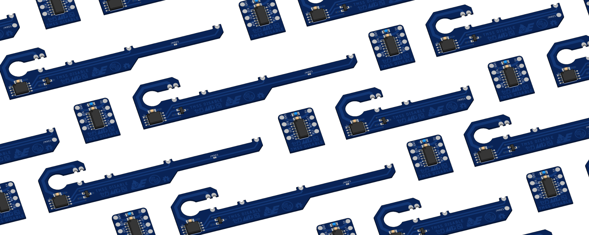
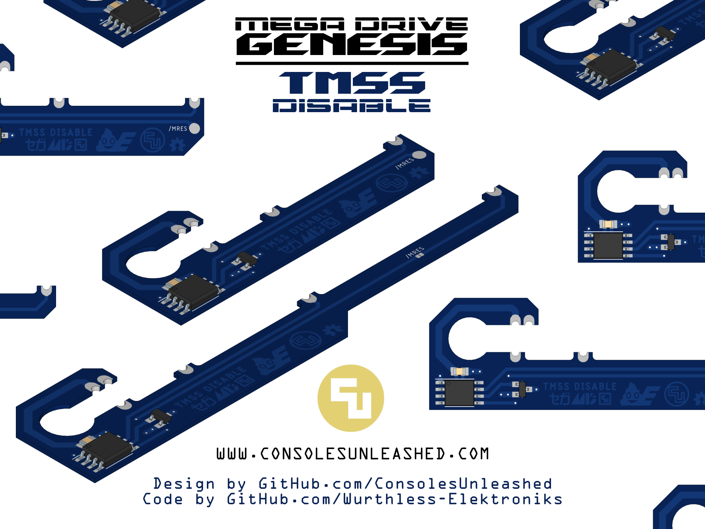
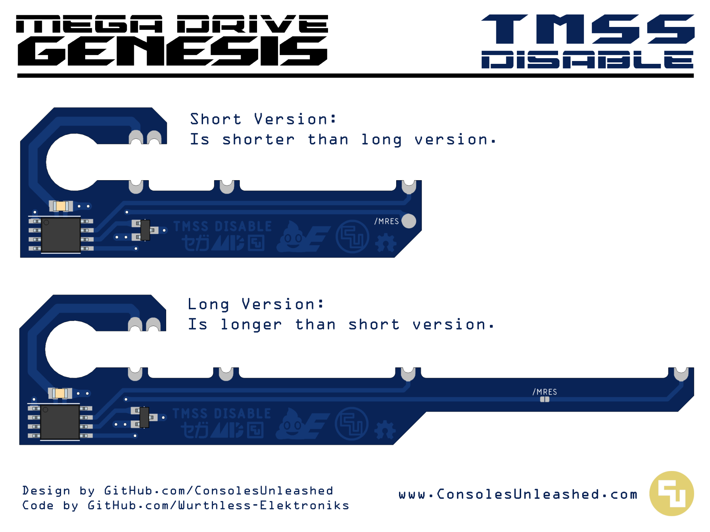

A collection of TMSS Disable mods I designed for Sega Mega Drive / Sega Genesis. Four versions added. One more to be added very soon. A design for every occasion.

# Sega Mega Drive TMSS Disable ATtiny Based Version

Coded by Wurthless-Elektroniks and designed by Consoles Unleashed.

A collaboration no one asked for and no one wanted, brings you a device no one needs.

The SEGA Mega Drive TMSS Disable. Catchiest name ever.

A quick solder board (QSB) PCB designed for Wurthless Elektroniks ATTINY code to disable TMSS in SEGA Mega Drive / Genesis consoles with no cuts or wires required.

## What does it do?

Details soon.

## What are the benefits?

Details soon.

## Are there any drawbacks?

Details soon. I am sure there are some.

## Manufacturing

- 0.8mm PCB thickness.
- Castellated vias are optional. There are only six half-cut vias and the board is thin which generally doesn't result in torn up copper platting. A little cleanup is usually necessary to remove debris from the half-cut vias.
- Blue PCB colour because Sonic the Hedgehog.

## Programming

Use the code available https://github.com/wurthless-elektroniks/sega-tmss-killer-attiny85/. Program before assembly using programmer of choice.

## Where to Buy?

https://www.consolesunleashed.com/product/sega-mega-drive-tmss-disable-attiny-mod-kit/

## Mod Kit Variations

There are two versions of this mod kit.

1 - A short version with a pad to wire /MRES.

2 - A long version that connects /MRES and includes a jumper to disable or enable the /MRES connection.

## Version History

Long version starts at v1.1 because of what is known as the clone problem in philosophy.

### QSB Short

- v1.0 - 10/02/2025 (wrong footprint for ATTINY chip, no /MRES connection, and no longness)
- v1.1 - 27/03/2025 (correct ATTINY footprint, and /MRES pad added)

### QSB Long

- v1.0 - 10/02/2025 (wrong footprint for ATTINY chip, no /MRES connection, and no longness)
- v1.1 - 27/03/2025 (correct ATTINY footprint, /MRES connection on PCB, /MRES jumper added, and longness added)

### Basic

- TBC

# Sega Mega Drive TMSS Disable Logic Based Version

Here is a simple logic based PCB to disable the TMSS. I designed it based on a schematic by Trimesh and put it here for completion. Not recomended over the ATtiny version.

## Manufacturing

- 0.8mm / 1mm / 1.2mm PCB thickness are all good. 1.6mm is unecessarily thick.
- Blue PCB colour because Sonic the Hedgehog.

## Where to Buy?

https://www.consolesunleashed.com/product/sega-mega-drive-tmss-disable-logic-mod-kit/

## Mod Kit Variations

Details soon.

## Version History

### Basic

- v1.0 - 03/02/2025
- v1.1 - 30/03/2025

### QSB

- v1.0 - 31/03/2025

## Licence

If you use this in any way, shape or form, you must include a link back to this repository and mention me by name on any sales pages and social media posts. Not only will this help me to keep designing mod kits and offering them to the community, but it is basic common courtesy as well. Don't be a douchebag. :)

Also this 'GNU GENERAL PUBLIC LICENSE Version 2, June 1991'.
